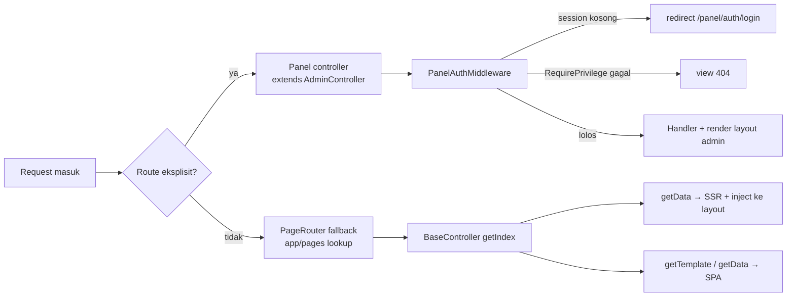

# Arsitektur yllumi/sayagi

> Dokumen ini membahas arsitektur internal package `yllumi/sayagi` — cara integrasi dengan Webman, alur request, autentikasi & privilege, routing frontend, settings, dynamic entry CRUD, serta sistem migrasi. Untuk panduan penggunaan, lihat [README.md](README.md).

---

## 1. Gambaran Umum

`yllumi/sayagi` adalah **Webman plugin bertipe `composer-plugin`** yang menghadirkan dua dunia dalam satu package:

1. **Panel admin** (`/panel/*`) — autentikasi, manajemen user/role/privilege, settings, menu, Redis browser, dan dynamic entry CRUD.
2. **Frontend page router** — routing berbasis folder `app/pages/` dengan dukungan SSR (server-side rendering), SPA (Pinecone), dan aplikasi mobile (Framework7).

Package ini bukan sekadar kumpulan class: ia **aktif saat composer install/update** (`ComposerPlugin`) untuk mem-publish config & aset ke project host, dan menyediakan command console untuk instalasi, migrasi, dan seeder.

```
┌──────────────────────────────────────────────────────────────┐
│                        Project Webman                         │
│  config/plugin/panel/*            app/pages/**  (halaman)     │
│  config/plugin/yllumi/sayagi/*    public/{panel,page}_theme/  │
│                          ▲                   ▲                │
│        publish (idempotent) │                   │ render/route │
│  ┌─────────────────────────────────────────────────────────┐  │
│  │                yllumi/sayagi (composer-plugin)          │  │
│  │  ComposerPlugin · PageRouter/FERouter · controllers     │  │
│  │  middleware · attributes · libraries · commands · views │  │
│  └─────────────────────────────────────────────────────────┘  │
└──────────────────────────────────────────────────────────────┘
```

---

## 2. Struktur Package

```
yllumi/sayagi/
├── composer.json           # type: composer-plugin → extra.class = ComposerPlugin
├── src/
│   ├── ComposerPlugin.php  # hook composer (POST_PACKAGE_INSTALL / POST_PACKAGE_UPDATE)
│   ├── PageRouter.php      # fallback router berbasis folder app/pages/
│   ├── FERouter.php        # jembatan route server ↔ client (Pinecone & Framework7)
│   ├── attributes/         # #[RequirePrivilege], #[FrontendRoute]
│   ├── app/
│   │   ├── command/        # command console (install, migrate, seed, user, ...)
│   │   ├── controller/     # controller panel + base AdminController
│   │   ├── helper/         # global helper (render, isAllow, setting, ...)
│   │   ├── middleware/     # PanelAuthMiddleware
│   │   └── view/           # template panel (Raw PHP + layout admin/auth)
│   ├── config/             # config plugin (app, route, view, command, ...)
│   ├── database/           # migrasi & seeder Phinx
│   └── libraries/          # Phpass, EmailSender, FormBuilder, Migration, Recaptcha
├── panel_theme/            # aset CSS/JS tema panel → public/panel_theme/
├── page_theme/             # aset tema frontend (Pinecone/F7) → public/page_theme/
└── templates/              # starter page template (basic_page, mobile_page)
```

### 2.1 Integrasi dengan Webman

| Mekanisme | Detail |
|---|---|
| `type: composer-plugin` | Composer memuat `Yllumi\Sayagi\ComposerPlugin` saat operasi composer |
| `autoload.psr-4` | `Yllumi\Sayagi\` → `src/` |
| `autoload.files` | `src/app/helper/common.php` di-load global (helper tersedia di seluruh app) |
| Plugin config | `src/config/*.php` di-publish ke `config/plugin/yllumi/sayagi/`; Webman auto-load `app.php`, `route.php`, `command.php`, dll |
| Data panel | `config/plugin/panel/` berisi `menu.yml`, `privileges.yml`, `settings/*.yml` (bukan config webman, melainkan data sayagi) |

---

## 3. Alur Request

### 3.1 Request Panel

```
Request /panel/...
  → config/plugin/yllumi/sayagi/route.php  (route eksplisit per-modul)
  → controller extends AdminController      (#[Middleware(PanelAuthMiddleware::class)])
  → PanelAuthMiddleware:
       1. cek session('user')
            - kosong & method bukan $noNeedLogin  → redirect /panel/auth/login
       2. baca #[RequirePrivilege] pada method → isAllow()
            - gagal → view 404
  → method controller (DI $request)
  → render(view, data, plugin, layout)       (layout 'admin' + partial)
```

`AdminController` adalah base class semua controller panel: menyediakan `$noNeedLogin` (method publik tanpa login) dan `$data` (`page_title`, `module`, `submodule`). Karena config `controller_reuse => false`, setiap request mendapat instance controller baru — **jangan simpan state di property controller**.

### 3.2 Request Frontend (halaman publik)

```
Request masuk (tidak cocok route eksplisit)
  → PageRouter::init()  (didaftarkan sebagai Route::fallback di route.php plugin)
  → telusuri app/pages/ berdasarkan path
      app/pages/home/PageController.php  →  app\pages\home\PageController
  → tentukan method: get{Verb}Index / get{Verb}{Action}
  → Webman\App::getCallback()  (bake params URL + wrap middleware + DI)
  → BaseController::getIndex → getData() → render layout + SSR injection
```

Callback & resolution route di-**cache di memori per worker** (`static $callbackCache`), sehingga lookup folder tidak diulang per request.

Dua perilaku frontend:

- **SSR** — `BaseController::getIndex` memanggil `getData()` untuk mengumpulkan data, merender template ke string (`pageView`), lalu meng-inject-nya ke layout. Konten langsung tampil tanpa request tambahan; `ssr_route` & `ssr_data` disuntikkan ke `window.__HEROIC_SSR_DATA__`.
- **SPA** — `getTemplate` (fragmen untuk async route) dan `getData` (JSON) dikonsumsi router client-side.

### 3.3 FERouter — jembatan server ↔ client

`FERouter` membaca hasil `PageRouter::scanFrontendRouters()` lalu menghasilkan data untuk router client:

| Method | Peran |
|---|---|
| `getRouterArray()` | Daftar route statis dari `app/pages/` (router Pinecone) |
| `getF7Routes('/mobile/')` | Route Framework7 — termasuk route dinamis dari `#[FrontendRoute(route: '/books/:id/')]` → `serverPath` + `param` |
| `getRouter($ssrRoute, $ssrContent, $ssrData)` | HTML router dengan konten SSR ter-inject (mengganti `x-template` Pinecone) |
| `ssrDataScript()` | `window.__HEROIC_SSR_DATA__` / `__HEROIC_SSR_URL__` untuk hidrasi data |

---

## 4. Autentikasi & Privilege

### 4.1 Autentikasi

- Login di `AuthController::doLogin`: lookup `mein_users` by email **atau** username dengan status `active`, lalu `Phpass::CheckPassword()`.
- Setelah sukses, `session('user')` diisi (`user_id`, `name`, `username`, `email`, `role_id`).
- Method publik (`login`, `doLogin`, `captcha`, `forgot`, `reset`, `register`) dideklarasikan di `$noNeedLogin`.
- Password di-hash dengan **Phpass** (portable PHP password hashing, format `$P$`), bukan bcrypt/argon.

### 4.2 Privilege

**Definisi** — `config/plugin/panel/privileges.yml`, format `feature: [ { action: deskripsi } ]`.

**Penyimpanan** — mapping role → privilege di tabel `mein_role_privileges` (`role_id`, `feature`, `privilege`), dikelola via UI `PrivilegeController`.

**Pengecekan** — `isAllow($privilege, $whitelistIds = [])`:

1. `user_id` ada di `whitelistIds` → lolos.
2. `role_id == 1` (Super) → lolos semua.
3. `rolePrivileges($roleId)` (cache 1 jam) → cocok `feature` + `action`.

**Guard deklaratif** — `#[RequirePrivilege('user.write')]` dibaca `PanelAuthMiddleware` via reflection; attribute bisa ditumpuk (semua harus terpenuhi / AND).

**Menu terfilter** — `sidebarMenus()` membaca `menu.yml`, memfilter child & parent dengan `isAllow`, dan menyembunyikan container induk yang tidak punya child terlihat.

---

## 5. Sistem Settings

- **Schema per group** — `config/plugin/panel/settings/{group}.yml`: `name`, `slug`, `menu_position`, dan daftar `setting` (field, label, tipe form, default, options).
- **Penyimpanan** — key-value di tabel `mein_options` (`option_group`, `option_name`, `option_value`).
- **Cache** — `SettingController::getGroupFromCache()` membaca group dari cache `panel_setting.{group}` (TTL 24 jam); `save()` me-bust cache group setelah menulis.
- **Helper `setting('group.key')`** — mengambil nilai DB/cache, fallback ke `default` di YAML bila belum pernah disimpan.
- **UI** — `SettingController` membangun tab per group; setiap field dirender oleh **FormBuilder**.

---

## 6. Dynamic Entry CRUD

`EntryController` adalah satu controller untuk banyak entitas — CRUD digerakkan schema YAML.

- **Schema** — `plugin/{nama}/panel/entry/{slug}.yml` (`name`, `table`, `fields`).
- **Data** — query builder dengan:
  - LEFT JOIN otomatis untuk setiap field ber-`relation` (`{table}.{value} = {rel_table}.{rel_display}` → kolom `{field}_display`).
  - Pencarian pada field bertanda `searchable` (LIKE).
  - Pagination + soft-delete default (`whereNull('deleted_at')`).
- **Form** — dibangun `FormBuilder` dari definisi field.
- **Store/Update** — insert/update generik berdasarkan tipe field.
- **Route** — `/panel/entry/{slug}...` didaftarkan eksplisit di `config/route.php`.

---

## 7. FormBuilder

- `FormBuilder::schemaArray()` / `schemaYaml()` → daftar component `BaseField`.
- Setiap tipe field adalah class terpisah di `libraries/FormBuilder/Components/{type}/{Type}Field.php`; `FieldResolverTrait` memetakan definisi schema → component.
- `render($values)` menghasilkan HTML form. Dipakai Settings, Dynamic Entry, dan form User/Role.

---

## 8. Database

Tabel dibuat oleh migrasi `src/database/migrations/*_install_plugin.php` (Phinx, `down()` drop seluruh tabel):

| Tabel | Isi |
|---|---|
| `mein_users` | User: `name`, `email`, `username`, `password`, `status` (default `inactive`), `role_id` (default 3), plus `phone`, `avatar`, `token`, `otp`, `last_login`, dll |
| `mein_roles` | Role: `role_name`, `role_slug`, `status`. Seeder `SayagiInitSeeder`: **1 = Super**, 2 = Member |
| `mein_role_privileges` | Mapping privilege per role: `role_id`, `feature`, `privilege` |
| `mein_user_profile` | Profil tambahan user (1:1): alamat, minat, pekerjaan, sosmed, rekening, dll |
| `mein_options` | Key-value settings: `option_group`, `option_name`, `option_value` |

> Tidak ada tabel `mein_privileges` / `mein_settings` — privilege disimpan di `mein_role_privileges`, settings di `mein_options`.

---

## 9. Command Console & Sistem Migrasi

Commands terdaftar di `src/config/command.php` (sumber) dan `config/plugin/yllumi/sayagi/command.php` (ter-publish) — keduanya harus sinkron.

| Command | Fungsi |
|---|---|
| `sayagi:install` | Publish config/aset + ganti `config/view.php` (Raw) + pilih starter template + rename `IndexController` → `.bak` |
| `sayagi:install-admin` | Cek DB → migrasi install → seeder → buat user admin pertama |
| `sayagi:publish-template` | Publish ulang starter template |
| `sayagi:user:create` | Buat user (interaktif / argumen) |
| `sayagi:update` | Update package (extend `Install`, migrasi sendiri) |
| `make:migration` / `migrate` / `migrate:rollback` / `db:seed` | Manajemen migrasi Phinx |

### Publish tersentralisasi

`Install::publishTo($projectRoot, $log)` adalah **satu-satunya sumber logika salin-menyalin** (menu/privileges/settings + `panel_theme`/`page_theme` + config plugin). Dipanggil oleh:

- `sayagi:install` → `publishFiles()` → `publishTo(base_path(), ...)`.
- `ComposerPlugin::publishFiles()` → `publishTo($projectRoot, ...)` saat `composer require`/`update`.

Helper `copyFile`/`copyDirectory` bersifat **copy-if-not-exists** (file existing di-skip), sehingga publish idempotent — config yang sudah dimodifikasi user tidak tertimpa.

### Migration library

- `libraries/Migration.php` membaca env `DB_*` → menghasilkan config Phinx (`adapter`, `host`, `name`, `user`, `pass`, `port`).
- `PLUGIN_PATH` menentukan direktori migrasi: core sayagi = `vendor/yllumi/sayagi/src/`, plugin lokal = `plugin/{nama}/`.
- `migrate -a` menjalankan migrasi core sayagi dulu, lalu SEMUA plugin yang punya `database/migrations` (urutan abjad), berhenti saat gagal.

---

## 10. Tema & Aset

| Sumber | Tujuan | Isi |
|---|---|---|
| `panel_theme/` | `public/panel_theme/` | CSS/JS panel admin: `app.css`, `app.js`, `form-builder.js`, `tinymce`, `myckeditor.js` |
| `page_theme/` | `public/page_theme/` | Tema frontend: Pinecone `js/main.js`, Framework7 `js/f7-app.js` + `framework7/` (termasuk kitchensink), CSS, logo |
| `templates/` | `app/pages/` | Starter template: `BaseController.php`, `_layouts/`, halaman contoh |

Helper `asset_url()` menambahkan versi dari `filemtime` untuk cache-busting.

### 10.1 Kitchensink Framework7 — Referensi Komponen Mobile

`public/page_theme/framework7/kitchensink/` adalah **demo lengkap komponen Framework7** yang dibundel di `page_theme`. Entry: `index.html`; tiap komponen punya halaman demo `pages/{name}.html` berisi markup + JS yang bisa langsung disalin. **Saat membuat halaman mobile di `app/pages/`, wajib mendahulukan komponen bawaan Framework7 ini** — jangan membangun komponen custom bila sudah tersedia.

#### Navigasi & Struktur Halaman

| Komponen | Demo (`pages/`) | Kegunaan |
|---|---|---|
| Navbar | `navbar.html`, `navbar-hide-scroll.html` | Bar navigasi atas (+ sembunyi saat scroll) |
| Subnavbar | `subnavbar.html`, `subnavbar-title.html` | Bar sekunder di bawah navbar |
| Toolbar / Tabbar | `toolbar-hide-scroll.html`, `toolbar-tabbar.html`, `tabbar.html`, `tabbar-icons.html`, `tabbar-scrollable.html` | Toolbar bawah, tab bar (ikon/label, scrollable) |
| Panel | `panel.html` | Panel kiri/kanan (drawer) |
| Page Transitions | `page-transitions.html`, `page-transitions-effect.html` | Efek transisi antar halaman |
| Master-Detail | `master-detail-master.html`, `master-detail-detail.html` | Layout master–detail (responsif) |
| Login Screen | `login-screen.html`, `login-screen-page.html` | Layar login (modal / halaman) |
| Page Loader | `page-loader-component.html` | Komponen loader per-halaman |

#### Konten & List

| Komponen | Demo (`pages/`) | Kegunaan |
|---|---|---|
| Content Block / Grid | `content-block.html`, `grid.html` | Blok konten & sistem kolom |
| Cards | `cards.html`, `cards-expandable.html` | Kartu konten (+ expandable) |
| List | `list.html`, `list-button.html`, `list-index.html`, `menu-list.html` | List view, tombol list, index alfabet, menu |
| Contacts List | `contacts-list.html` | Daftar kontak dengan inisial |
| Timeline | `timeline.html` | Garis waktu / riwayat |
| Treeview | `treeview.html` | Struktur pohon |
| Smart Select | `smart-select.html` | Dropdown ala native via list |
| Sortable | `sortable.html` | List bisa diurutkan (drag) |
| Swipeout | `swipeout.html` | Aksi swipe (hapus/edit) |
| Virtual List | `virtual-list.html`, `virtual-list-vdom.html` | Render list besar secara virtual |
| Data Table | `data-table.html` | Tabel data responsif |
| Accordion | `accordion.html` | Konten tarik-turun |
| Breadcrumbs | `breadcrumbs.html` | Jejak navigasi |

#### Tombol, Input & Form

| Komponen | Demo (`pages/`) | Kegunaan |
|---|---|---|
| Buttons / Segmented | `buttons.html`, `segmented.html` | Tombol & segmented control |
| Chips / Badge | `chips.html`, `badge.html` | Tag & lencana |
| Stepper / Toggle | `stepper.html`, `toggle.html` | Stepper angka, switch on/off |
| Checkbox / Radio | `checkbox.html`, `radio.html` | Seleksi |
| Range | `range.html` | Slider |
| Inputs / Form Storage | `inputs.html`, `form-storage.html` | Form input & penyimpanan form |
| FAB | `fab.html`, `fab-morph.html` | Floating action button (+ morph) |
| Searchbar | `searchbar.html`, `searchbar-expandable.html` | Pencarian |
| Autocomplete / Picker / Color Picker | `autocomplete.html`, `picker.html`, `color-picker.html` | Pilihan nilai |
| Text Editor | `text-editor.html` | Editor teks kaya |

#### Overlay & Feedback

| Komponen | Demo (`pages/`) | Kegunaan |
|---|---|---|
| Dialog | `dialog.html` | Alert/confirm/prompt |
| Popup / Popover | `popup.html`, `popover.html` | Layar modal & tooltip konteks |
| Action Sheet / Sheet Modal | `action-sheet.html`, `sheet-modal.html` | Lembar aksi & modal bawah |
| Notifications / Toast / Tooltip | `notifications.html`, `toast.html`, `tooltip.html` | Notifikasi & pesan singkat |
| Preloader / Progressbar / Skeleton | `preloader.html`, `progressbar.html`, `skeleton.html` | Indikator loading |
| Pull to Refresh / Infinite Scroll | `pull-to-refresh.html`, `infinite-scroll.html` | Muat data geser bawah / tanpa batas |

#### Media & Visualisasi

| Komponen | Demo (`pages/`) | Kegunaan |
|---|---|---|
| Icons | `icons.html` | Framework7 Icons (`f7-icons`) |
| Photo Browser | `photo-browser.html` | Galeri foto layar penuh |
| Swiper | `swiper.html` + varian (`swiper-horizontal`, `swiper-vertical`, `swiper-fade`, `swiper-loop`, `swiper-lazy`, `swiper-zoom`, `swiper-3d-coverflow`, `swiper-3d-cube`, `swiper-3d-flip`, `swiper-gallery`, `swiper-multiple`, `swiper-nested`, `swiper-parallax`, `swiper-pagination-fraction`, `swiper-pagination-progress`, `swiper-scrollbar`, `swiper-space-between`) | Slider/carousel & varian efek |
| Charts | `area-chart.html`, `pie-chart.html`, `gauge.html` | Grafik area, pie, gauge |
| Messages | `messages.html` | Tampilan chat/pesan |

#### Tab & Tema

| Komponen | Demo (`pages/`) | Kegunaan |
|---|---|---|
| Tabs | `tabs.html`, `tabs-static.html`, `tabs-animated.html`, `tabs-routable.html`, `tabs-swipeable.html` | Tab konten (statis/animasi/routable/swipe) |
| Calendar | `calendar.html`, `calendar-page.html` | Kalender (popup/halaman) |
| Color Themes | `color-themes.html` | Ganti tema warna |

---

## 11. Diagram Alur Request



---

## 12. Ekstensi untuk Plugin Lain

Plugin Webman lain dapat memanfaatkan sayagi dengan:

- **Dynamic Entry** — taruh schema YAML di `plugin/{nama}/panel/entry/` → CRUD otomatis di `/panel/entry/{slug}`.
- **View** — helper `render()` / `cell()` auto-detect base view path plugin dari namespace (`plugin\{nama}` lokal atau vendor via PSR-4); layout fallback ke panel.
- **Privilege** — tambahkan definisi di `privileges.yml` & beri `#[RequirePrivilege]` pada controller yang `extends AdminController`.
- **Settings** — tambahkan `{group}.yml` di `config/plugin/panel/settings/`.
- **Halaman publik** — buat folder di `app/pages/` berisi `PageController.php` + `template.php`.
- **Migrasi** — letakkan `database/migrations/` di plugin → otomatis ikut `php webman migrate -a`.

---

## 13. Keputusan Arsitektur (Catatan)

- **Raw PHP template, bukan Blade/Twig** — config `view.php` di-publish ke handler `support\view\Raw`; view ditulis PHP murni.
- **`controller_reuse => false`** — state per-request dihindari; semua data lewat parameter method & `$this->data` yang di-reset per request.
- **Phpass untuk password** — kompatibel hash lama (portable), bukan bcrypt-native.
- **Settings di DB + YAML default** — nilai runtime di `mein_options`, schema & default di YAML → user bisa edit via UI tanpa sentuh kode.
- **Router frontend sebagai fallback** — halaman publik tanpa route eksplisit tetap jalan via `app/pages/`; route dinamis didaftarkan eksplisit untuk menghindari konflik segment.
